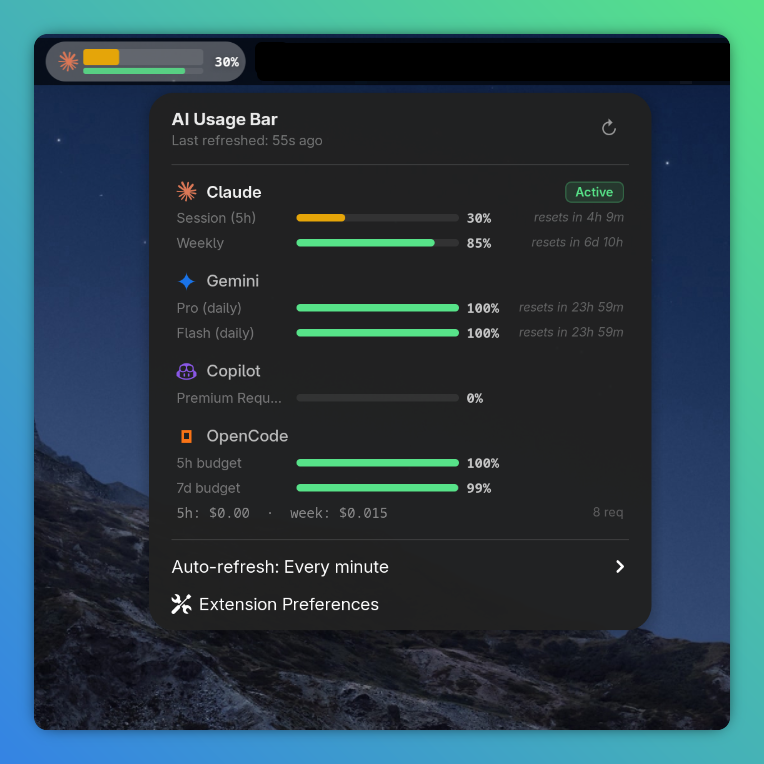
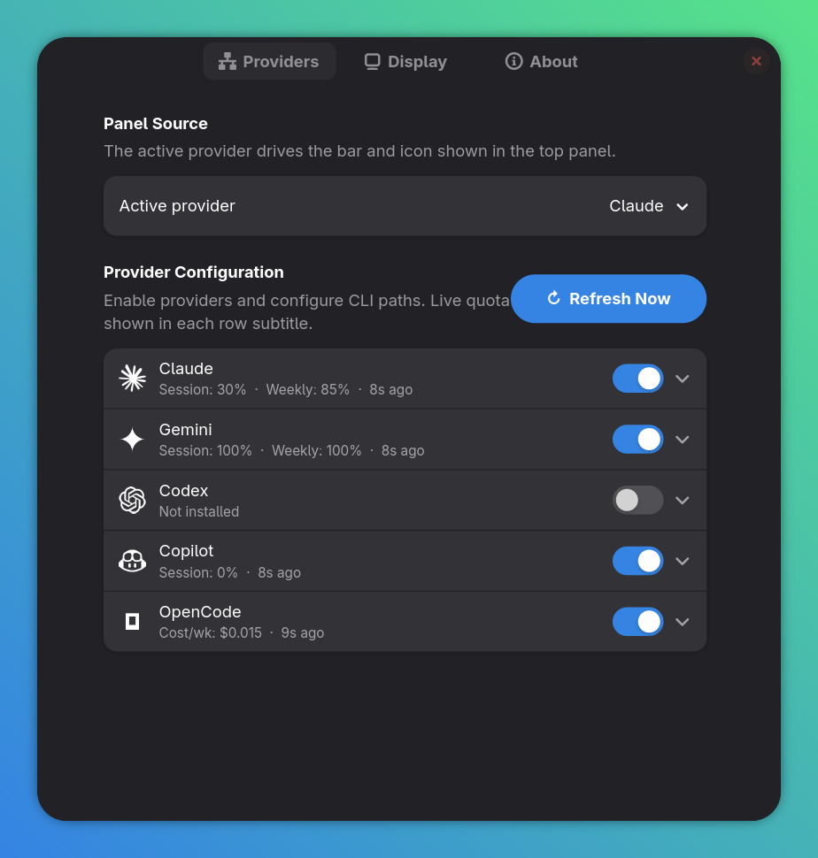

<div align="center">
  
  <h1>AI Usage Bar</h1>
  <p><b>A GNOME Shell extension that keeps your AI coding quotas visible in the top panel.</b></p>

  [](metadata.json)
  [](LICENSE)
</div>

<br />

`AI Usage Bar` tracks remaining quota across **Claude**, **Gemini**, **Codex**, **GitHub Copilot**, and **OpenCode**. It renders the active provider as a compact panel meter, keeps the rest one click away in the popup, and preserves the last known values across GNOME Shell restarts.

Inspired by [codexbar](https://github.com/steipete/codexbar) for macOS, but built natively for GNOME Shell.

> Distributed through GitHub for now. This project is **not** published on extensions.gnome.org yet.

<div align="center">
  
</div>

## ✨ Highlights

- **Compact two-bar panel meter** for the active provider:
  - **Main bar:** session or primary quota window
  - **Thin bar:** weekly quota window when the provider exposes one
- **One-click provider switching** directly from the popup menu
- **GNOME-native popup details** with per-provider rows, quota bars, reset countdowns, and manual refresh
- **Automatic refresh** on a schedule and again after resume from suspend
- **Cached last-known data** so the indicator is still useful right after GNOME Shell restarts
- **Uses your existing CLI authentication** — no separate dashboard login and no extra account setup inside the extension

## 🔌 Supported providers

| Provider | What it shows | Auth source | Notes |
|---|---|---|---|
| **Claude** | 5-hour session + 7-day weekly quota | `claude` CLI / `~/.claude/.credentials.json` | Uses your existing Claude Code auth state |
| **Gemini** | Per-model quota buckets | `gemini` CLI / `~/.gemini/oauth_creds.json` | Shows the most constrained parsed bucket data |
| **Codex** | 5-hour session + 7-day weekly quota | `codex` CLI / `~/.codex/auth.json` | Falls back to CLI status parsing when needed |
| **GitHub Copilot** | Premium request balance | `gh auth login` / GitHub CLI auth state | Balance-style quota, not a 5-hour / 7-day meter |
| **OpenCode** | Cost mode or Go subscription usage | `opencode` CLI / `~/.local/share/opencode/opencode.db` | Optional live Go quota fetch from the OpenCode web console |

## 📋 Requirements

- **GNOME Shell 49 or 50**
- `gnome-extensions` and `glib-compile-schemas` available on your system
- `python3` for the included install and packaging scripts
- The CLI tool for each provider you want to monitor must be installed and authenticated locally

## 🚀 Installation

### Quick install from this repository

Clone the repository and run the included installer:

```bash
git clone https://github.com/GitSoks/gnome-ai-usage-bar.git
cd gnome-ai-usage-bar
bash install.sh
```

The installer compiles the GSettings schema, packages the extension, installs it with `gnome-extensions install --force`, and enables it automatically.

If you are on Wayland and the extension does not appear immediately, log out and back in.

To inspect GNOME Shell logs after installation:

```bash
journalctl /usr/bin/gnome-shell --since='1 min ago' -f
```

### Manual installation from source

If you prefer to install step by step:

```bash
# Clone into the GNOME extensions directory
git clone https://github.com/GitSoks/gnome-ai-usage-bar.git \
    ~/.local/share/gnome-shell/extensions/ai-usage-bar@sokolowski.tech

# Compile the settings schema
glib-compile-schemas \
    ~/.local/share/gnome-shell/extensions/ai-usage-bar@sokolowski.tech/schemas/

# Enable the extension
gnome-extensions enable ai-usage-bar@sokolowski.tech
```

> On X11 you can usually reload GNOME Shell with `Alt+F2`, then `r`. On Wayland, log out and back in.

### Build a release zip

For a GitHub release asset or manual distribution build:

```bash
bash package-extension.sh
```

This creates `ai-usage-bar@sokolowski.tech.shell-extension.zip` in the repository root.

## 🔐 Authentication and privacy

AI Usage Bar does **not** create a separate account or ask you to re-enter provider credentials inside the extension. It reads the same local auth state and data sources that the provider CLIs already use.

- If a provider row says **Not installed**, the CLI was not found at the configured path.
- If a provider row says **Not authenticated**, run that provider's CLI once and complete its normal login flow.
- The extension only talks to provider-owned endpoints when that provider requires a network fetch.

## ⚙️ Provider setup

Each provider can be enabled or disabled independently in **Preferences → Providers**.

<details>
<summary><b>Claude</b></summary>

```bash
npm install -g @anthropic-ai/claude-code
claude
```

Complete the normal browser login flow. If you keep Claude credentials in a non-default config directory, set that override in **Preferences → Providers → Claude**.
</details>

<details>
<summary><b>Gemini</b></summary>

```bash
npm install -g @google/gemini-cli
gemini
```

Complete the normal browser login flow. The extension reads the CLI OAuth credentials from your local Gemini config.
</details>

<details>
<summary><b>Codex</b></summary>

```bash
npm install -g @openai/codex
codex
```

Complete the normal login flow. If the richer status path is unavailable, AI Usage Bar falls back to the CLI status output where possible.
</details>

<details>
<summary><b>GitHub Copilot</b></summary>

```bash
gh auth login
```

The extension reads the GitHub CLI auth state already present on your machine. No additional Copilot-specific setup is required inside the extension.
</details>

<details>
<summary><b>OpenCode</b></summary>

```bash
npm install -g opencode-ai
opencode
```

OpenCode supports two display styles:

- **Cost mode:** shows rolling spend from the local OpenCode database
- **Go subscription mode:** shows call-based usage, with optional live web fetch from the OpenCode console

If you configure 5-hour and 7-day budgets in **Preferences → Providers → OpenCode**, the panel shows remaining-budget percentages instead of raw USD values.
</details>

## 🛠️ Configuration

Open **Preferences** from the popup menu or from the Extensions app.

<div align="center">
  
</div>

### Providers page

- Choose the **active provider** that drives the panel bar and icon
- Enable or disable providers individually
- Override default CLI paths
- See each provider's live status and last fetched summary directly in the row subtitle
- Configure OpenCode budgets, Go subscription limits, and optional auto-fetch settings

### Display page

- Choose the panel area and position index
- Show or hide the provider icon and weekly bar
- Show no text, session text, weekly text, or both next to the bar
- Adjust the panel bar width
- Customize warning and critical thresholds
- Tune the stale-data timeout, startup refresh behavior, and background refresh interval

### About page

- Shows version, project links, author, and license information

## 💡 Runtime behavior

- **Stale data dimming:** the panel indicator fades when the cached data is older than the configured timeout
- **Resume-aware refresh:** the extension refreshes automatically about 3 seconds after the machine wakes from suspend
- **Startup cache:** the last-known quota is saved in GSettings so the bar is not blank after GNOME Shell restarts
- **Parallel refreshes:** enabled providers are polled in parallel instead of serially
- **Quick switching:** click a provider row in the popup to make it the active panel source
- **Provider-aware weekly bar:** providers without a weekly concept simply omit the thin secondary bar

## 🧪 Testing

This repository includes a live integration script at `tests/test_providers.mjs`.

It checks provider credential detection and parsing against your locally authenticated accounts, so results will vary depending on your subscriptions and current quota state.

Before running it, make sure:

- the relevant provider CLI is installed and logged in
- the machine has network access for providers that use online APIs
- you are using a recent Node.js version with `fetch` support

```bash
node tests/test_providers.mjs
```

## 🩺 Troubleshooting

- **The extension does not appear after install:** on Wayland, log out and back in; on X11, try `Alt+F2` then `r`.
- **A provider shows “Not installed”:** verify the CLI is on your `PATH` or set the full executable path in **Preferences → Providers**.
- **A provider shows “Not authenticated”:** run that CLI manually and complete its normal login flow.
- **The bar looks stale or dimmed:** use **Refresh Now**, or switch the refresh interval away from **Manual only**.
- **OpenCode Go auto-fetch fails:** re-check the workspace ID and auth cookie, or disable auto-fetch and use the manual quota settings instead.
- **Need logs:** run `journalctl /usr/bin/gnome-shell --since='5 min ago' -f` and watch for `AIUsageBar` messages.

## 🗑️ Uninstall

If you installed the extension with the packaged zip or `install.sh`:

```bash
gnome-extensions disable ai-usage-bar@sokolowski.tech
gnome-extensions uninstall ai-usage-bar@sokolowski.tech
```

If you manually cloned the repository into the extensions directory, remove it after disabling:

```bash
rm -rf ~/.local/share/gnome-shell/extensions/ai-usage-bar@sokolowski.tech
```

## 📄 License

This project is licensed under the **GNU General Public License v3.0** — see the [LICENSE](LICENSE) file for details.

## 👨‍💻 Author

David Sokolowski — [Website/Git](https://git.sokolowski.tech/david) | [GitHub](https://github.com/GitSoks)
